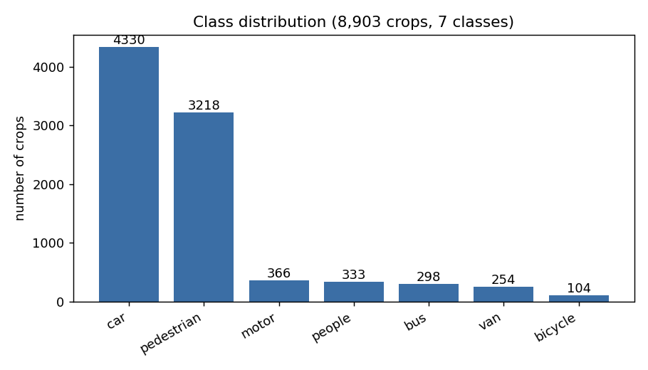
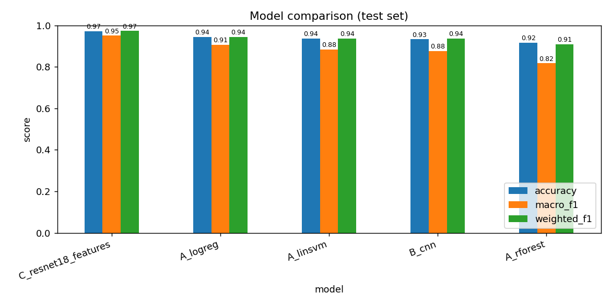
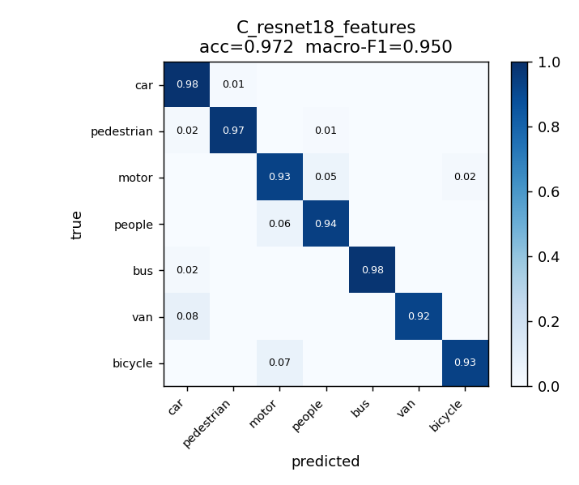

# Multi-Class Object Classification from UAV Imagery

Comparing **classical machine learning**, a **CNN trained from scratch**, and **transfer learning** for classifying objects detected in drone (UAV) footage.

> Built on a VisDrone-MOT sequence. The best model — an ImageNet-pretrained **ResNet18** used as a feature extractor — reaches **97.2% accuracy** and **0.950 macro-F1** across seven classes.

*Author: Jay Hadiyal*

---

## Overview

Drone footage gives a wide aerial view of traffic scenes containing many object types. This project builds a clean image-classification dataset from an annotated UAV video sequence and uses it to fairly compare three families of models on identical data:

1. **Classical ML** — handcrafted HOG + colour features fed to Logistic Regression, a Linear SVM, and a Random Forest.
2. **CNN from scratch** — a small convolutional network (~94.6k parameters).
3. **Transfer learning** — an ImageNet-pretrained ResNet18 used as a fixed feature extractor with a small trained head.

The headline question: *do learned and transferred features actually beat a simple handcrafted baseline on a small, heavily imbalanced aerial dataset?*

---

## Dataset

The source is a single **VisDrone-MOT** sequence (146 frames at 1904×1071). Each annotation gives a bounding box and class, which is cropped from its frame into a per-class folder.

**Cleaning steps**
- Removed 1,394 "ignored region" boxes (class 0).
- Removed degenerate boxes smaller than 8 px.
- Only **7 of 10** classes occur — truck, tricycle and awning-tricycle have zero instances and were excluded.

**Result:** 8,903 labelled crops from 175 tracked objects.

| Class | Crops |
|---|---:|
| car | 4,330 |
| pedestrian | 3,218 |
| motor | 366 |
| people | 333 |
| bus | 298 |
| van | 254 |
| bicycle | 104 |



The dataset is **severely imbalanced** (car vs. bicycle ≈ 42:1), which drives every design decision below.

---

## Key challenges and how they were addressed

| Challenge | Approach |
|---|---|
| Severe class imbalance (42:1) | Class-weighted losses / balanced classifiers; **macro-F1** as the headline metric; stratified split. |
| Ignored regions & empty classes | Filtered class-0 boxes; reduced the task from 10 to the 7 classes that occur. |
| Extreme scale variation (8–295 px wide) | Resize every crop to a fixed size per model; discard sub-8 px boxes. |
| Track-induced leakage (175 tracks) | Built an optional **track-disjoint split** so near-duplicate crops of the same object can't appear in both train and test. |
| Limited compute (CPU only) | Used ResNet18 as a **fixed feature extractor** rather than full end-to-end fine-tuning. |

---

## Method

| Model | Input | Description |
|---|---|---|
| **A — Classical ML** | 48 px | HOG (shape) + per-channel colour mean/std → Logistic Regression, Linear SVM, Random Forest (balanced class weights). |
| **B — CNN from scratch** | 64 px | 3 conv blocks (Conv-BN-ReLU-Pool) → global pool → dropout → linear head. ~94.6k params, class-weighted loss, horizontal-flip augmentation. |
| **C — Transfer learning** | 224 px | ImageNet-pretrained ResNet18 as a fixed feature extractor → small two-layer classifier head, class-weighted loss. |

**Experimental setup:** Adam optimizer · stratified 70% / 15% / 15% train/val/test split · model selected at best validation macro-F1 · fixed random seed 42 for reproducibility.

**Why macro-F1?** Under this much imbalance, accuracy is misleading — a model that almost always predicts "car" already scores high. Macro-F1 averages F1 across all seven classes equally, so rare classes count just as much as common ones.

---

## Results

All figures are on the held-out **test set** (1,336 crops), ranked by macro-F1.

| Model | Accuracy | Macro-P | Macro-R | Macro-F1 | Weighted-F1 |
|---|---:|---:|---:|---:|---:|
| **ResNet18 (transfer)** | **0.972** | **0.951** | **0.950** | **0.950** | **0.973** |
| Logistic Regression | 0.945 | 0.904 | 0.909 | 0.907 | 0.945 |
| Linear SVM | 0.936 | 0.886 | 0.887 | 0.884 | 0.936 |
| CNN (from scratch) | 0.933 | 0.844 | 0.934 | 0.877 | 0.935 |
| Random Forest | 0.917 | 0.965 | 0.751 | 0.817 | 0.909 |



### Per-class performance of the best model (ResNet18)

| Class | Precision | Recall | F1 | Support |
|---|---:|---:|---:|---:|
| car | 0.979 | 0.985 | 0.982 | 650 |
| pedestrian | 0.981 | 0.969 | 0.975 | 483 |
| motor | 0.927 | 0.927 | 0.927 | 55 |
| people | 0.839 | 0.940 | 0.887 | 50 |
| bus | 1.000 | 0.978 | 0.989 | 45 |
| van | 1.000 | 0.921 | 0.959 | 38 |
| bicycle | 0.933 | 0.933 | 0.933 | 15 |



---

## Key findings

- **Transfer learning wins clearly.** Features learned on millions of natural images transfer well even to a small, domain-shifted aerial dataset.
- **The classical baseline is surprisingly strong.** Logistic Regression on HOG+colour (0.907 macro-F1) beats the from-scratch CNN on macro-F1 — rigid vehicle shapes viewed from above are highly discriminative, and a few thousand crops isn't much to train a CNN from nothing.
- **Accuracy alone is misleading.** The Random Forest has the highest precision yet the lowest macro-F1: its recall on the rare *people* class collapses to 0.26, which a raw accuracy score hides entirely.
- **The hardest case is people ↔ pedestrian.** From above, a small group of people and a single pedestrian look very similar — this is the dominant residual error for every model.

---

## Repository structure

```
.
├── src/
│   ├── 01_prepare_dataset.py   # crop objects from frames → dataset/crops/<class>/
│   ├── 02_analyze_split.py     # figures + stratified & track-aware splits
│   ├── common.py               # shared loading / evaluation utilities
│   ├── 03_classical_ml.py      # Model A: HOG + LogReg / SVM / Random Forest
│   ├── 04_cnn_scratch.py       # Model B: small CNN
│   ├── 05_transfer_resnet.py   # Model C: ResNet18 transfer learning
│   ├── 06_compare.py           # aggregate results → summary table + chart
│   └── run_all.py              # run the whole pipeline end to end
├── figures/                    # generated charts and confusion matrices
├── report/                     # plain-language project report (Markdown)
├── requirements.txt
└── README.md
```

---

## How to run

```bash
# 1. Install dependencies (a virtual environment is recommended)
pip install -r requirements.txt

# 2. Place the VisDrone-MOT sequence where the script expects it
#    (see 01_prepare_dataset.py — it auto-detects the data folder)

# 3. Run the full pipeline
python src/run_all.py
```

Or run each stage individually:

```bash
python src/01_prepare_dataset.py     # build the crops + index
python src/02_analyze_split.py       # figures + train/val/test splits
python src/03_classical_ml.py        # Model A
python src/04_cnn_scratch.py         # Model B
python src/05_transfer_resnet.py     # Model C
python src/06_compare.py             # comparison table + chart
```

The code is device-agnostic (CPU or GPU) and memory-safe. Results are written to `results/` and `reports/`.

> **Dataset note:** the raw VisDrone data is **not** included in this repository (it has its own licence and is large). Download it from the official [VisDrone](https://github.com/VisDrone/VisDrone-Dataset) source.

---

## Limitations and future work

- Results use a **single sequence**, so absolute numbers may not generalise to other scenes.
- The rarest classes have few test examples (bicycle: 15).
- The headline numbers use a **stratified** split that does not fully remove track correlation; the **track-disjoint** split is provided to obtain leakage-free estimates.
- **Future work:** end-to-end fine-tuning of larger backbones; evaluation on the track-disjoint split; gathering the missing classes from additional VisDrone sequences; addressing imbalance with focal loss or oversampling.

---

## References

1. N. Dalal and B. Triggs, "Histograms of oriented gradients for human detection," *IEEE CVPR*, 2005.
2. A. Krizhevsky, I. Sutskever, G. E. Hinton, "ImageNet classification with deep convolutional neural networks," *NeurIPS*, 2012.
3. K. He, X. Zhang, S. Ren, J. Sun, "Deep residual learning for image recognition," *IEEE CVPR*, 2016.
4. P. Zhu et al., "Detection and tracking meet drones challenge," *IEEE TPAMI*, 2022.

---

## Acknowledgements

Dataset: VisDrone-MOT, used under its original licence. This is a personal portfolio project.
